# General Assembly Project 1: Tetris Game

## Table of Contents:
1. [Overview](#overview)
1. [Brief](#brief)
1. [Approach](#approach)
1. [Work Split](#worksplit)
1. [Wins](#wins)
1. [Challenges](#challenges)
1. [Key Learnings/Takeaways](#key-learningstakeaways)
1. [Future Features](#future-features)
1. [Bugs](#bugs)

## Overview:
My second project in the Software Engineering Immersive Course and my first time coding in a pair with Christian Baker. The project was an online dictionary with a history function and with links on the words to new definitions using a public API.

## Brief:
**Goal:** Create an online dictionary using a public API.

**Timeframe:** 2 days.

**Group-size:** Pair.

**Software used:** JavaScript, React, A public API, Bulma, Sass.

**Deployed version:** https://sei-kiratarik-project-two.netlify.app

## Approach:
Our intention with this project was to choose something simple but with many features we could add as we went. We eventually chose this and although we struggled with splitting up the work we eventually split things up such that I focussed on the nitty gritty of JavaScript and React that I was best at, while my partner focussed on other parts including all of the styling. My approach was to look through what the public API provided and find ways to use all of it before neatening up and making the results consistent and presentable, and then figuring out new features to add.

First we discussed what project to do, entertaining the idea of a movie search system but unable to find an appropriate public API to use. We ended up browsing APIs for ideas until agreeing on the dictionary idea after I found a public API we could use. We made some wireframes for how it would look, deciding to try and use as much of the data that the API provided as we could. We then came up with a stretch goal of a History system so that users can easily find words they have already searched for recently:
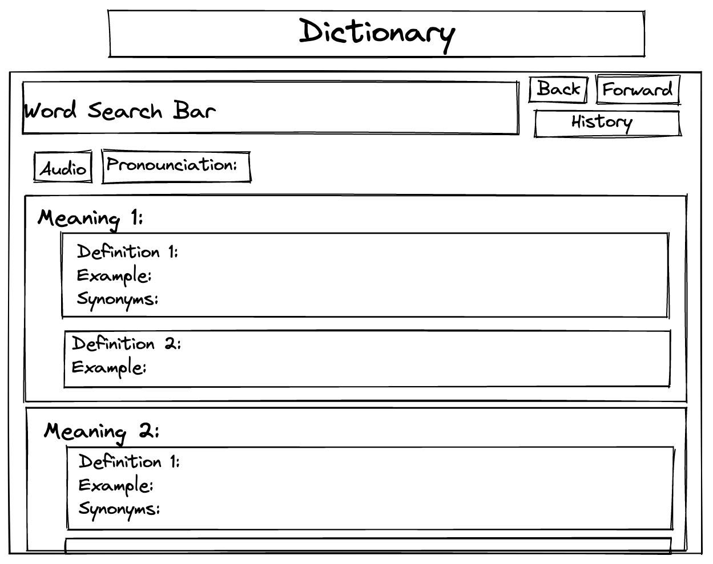

## Work Split:
We were inexperienced in working in pairs and using the Liveshare software resulting in us often working on the same code at the same time while bouncing ideas off of each other. The end result is that for the majority of the code, I cannot say that it is distinctly one or the other’s work. Exceptions to this include styling which was almost all Chrisian. Notable code that was almost all me include sentence structure correction and the part of the code that detects unwanted punctuation for the links.

To get the data we would use axios to send a get request to the public API with the word we want to check at the end of the url of the get request:
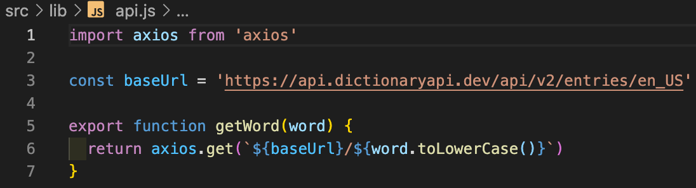

We found that the response data from the public API could be inconsistent in several ways including structurally. We wrote code to check for a structure’s existence before trying to display it such as if the definition object had an example property or if the synonyms property existed or was an empty array. We also coded to number the definitions if there are more than one:
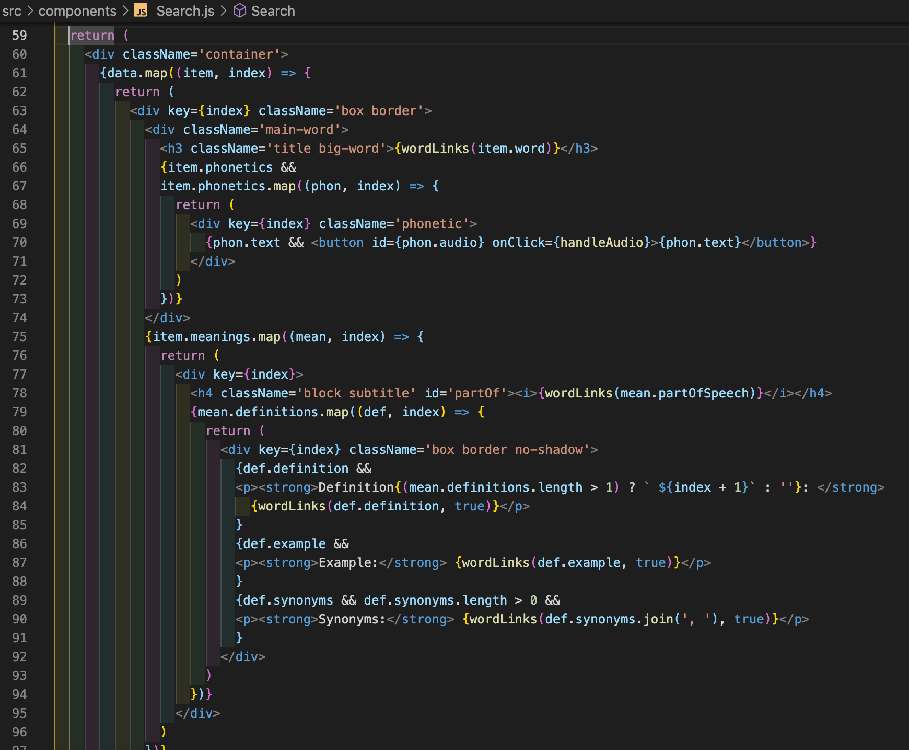
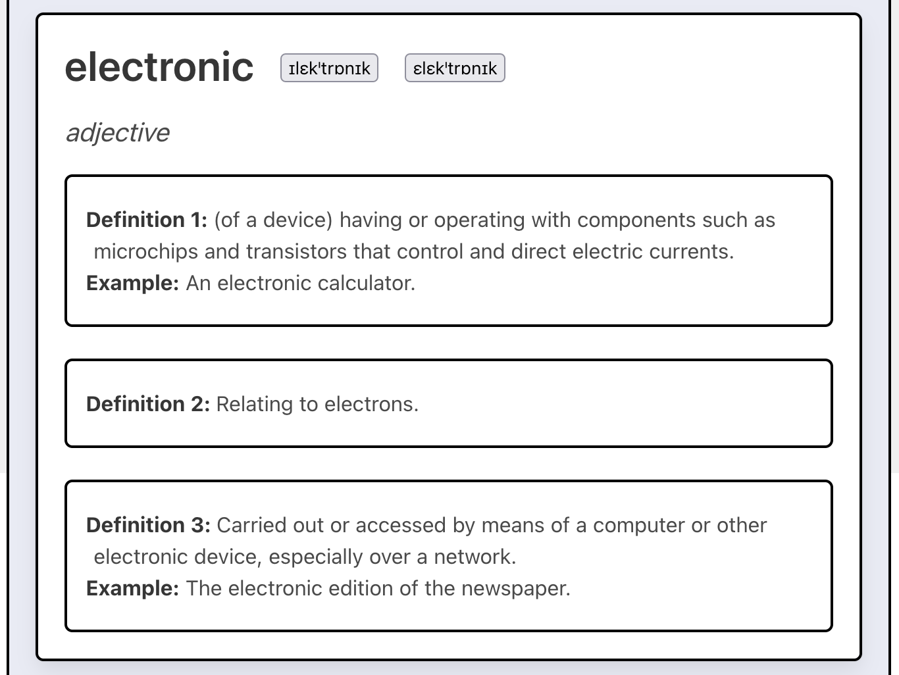

For the audio we made a small async function that played the audio when you clicked on the phonetic button.

The return from the public API was inconsistent when it came to starting the sentence with a capital letter and ending it with punctuation. So I wrote a program to check and correct the first and last characters of the sentence:
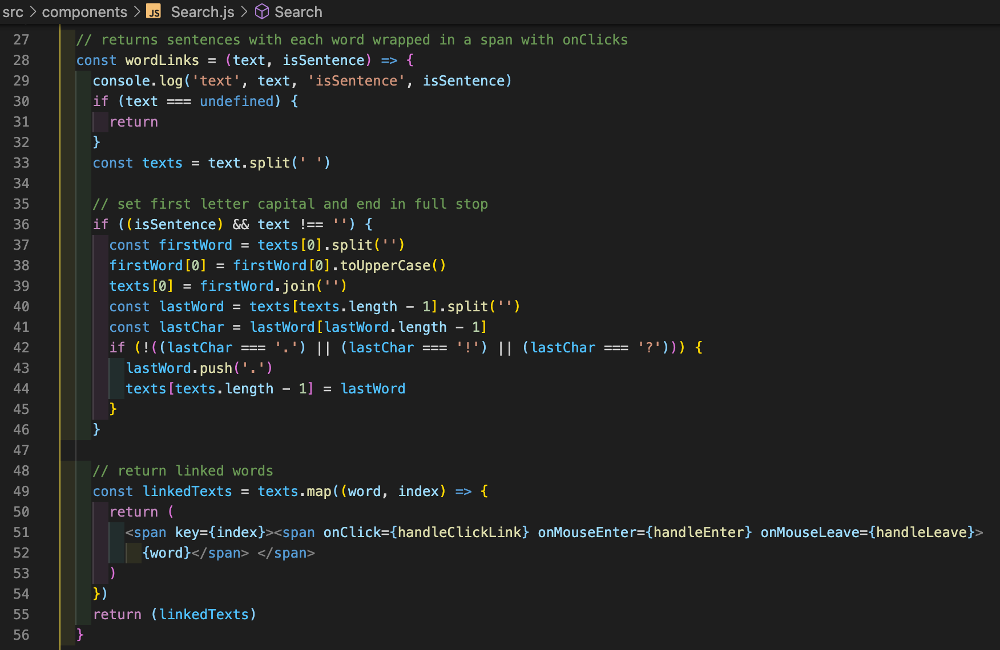

We also had the idea for you to be able to click on a word in the definition and the website to automatically check the definition of that word. So we added an onclick function to each word and made it so that they highlight yellow when mouse over and red when the link fails.

There was a problem with the links and that was the words sometimes had punctuation around them including things like brackets but also could have unusual characters like dashes and apostrophes in the middle. So I wrote a function to check for an unknown number of punctuation characters on either side of the word and ignore them when searching for its definition. It was then that it would search for the word using the public API:
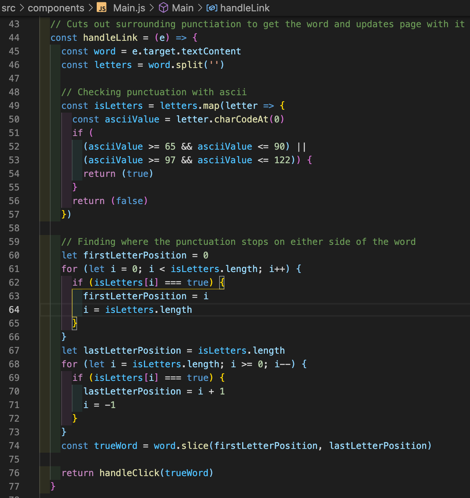

We decided to add a History feature at around this time. In implementing the History function, we split the page up into a History and Search page.

We made it so that clicking a link added the word to the end of a history array with a pointer variable so we could add back and forward buttons:
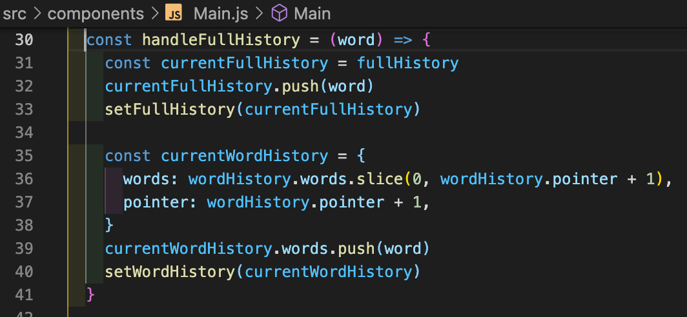

The History page displayed the words you had clicked on as buttons in reverse order so you could easily find words you had previously checked:
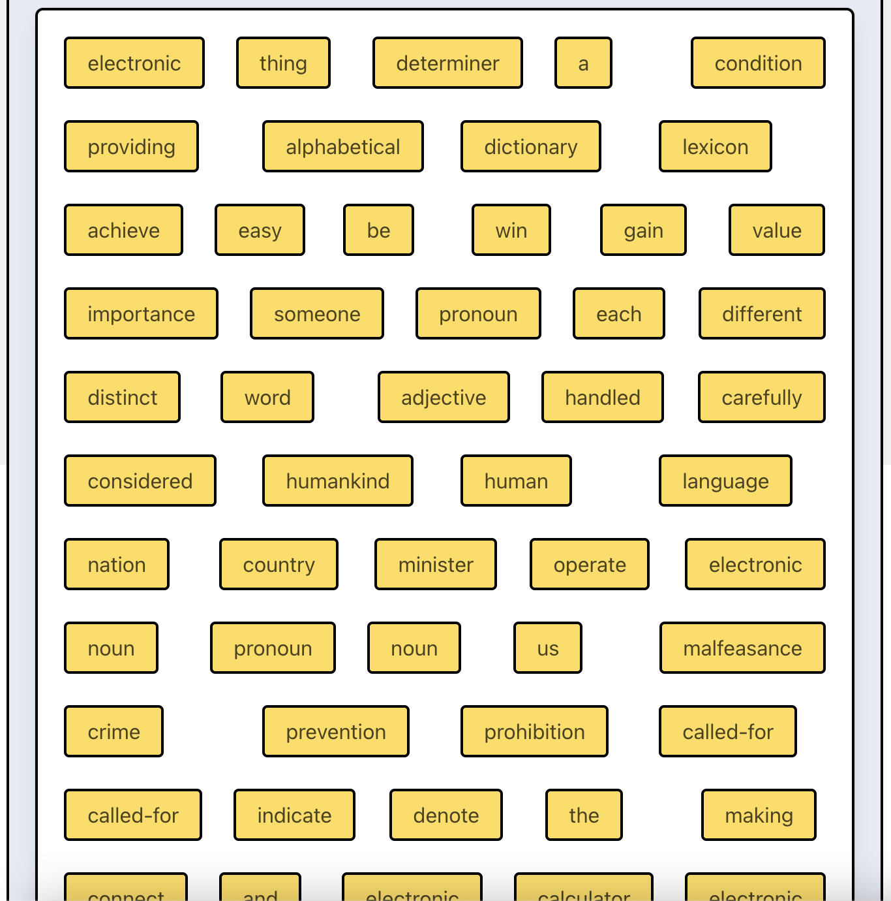

We also included an input section that was visible on both the History page and the Search page so you could change pages, go back and forward along the History, and manually search for words.

The back and forward buttons used the pointer variable to move up and down the history list:
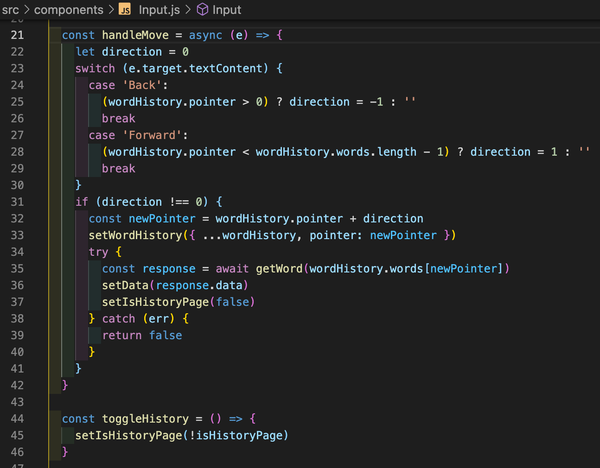

The search page would default to ‘dictionary’ when the search bar was empty and it loaded for the first time as it looked nicer and would try to search for a word whenever the input changed:
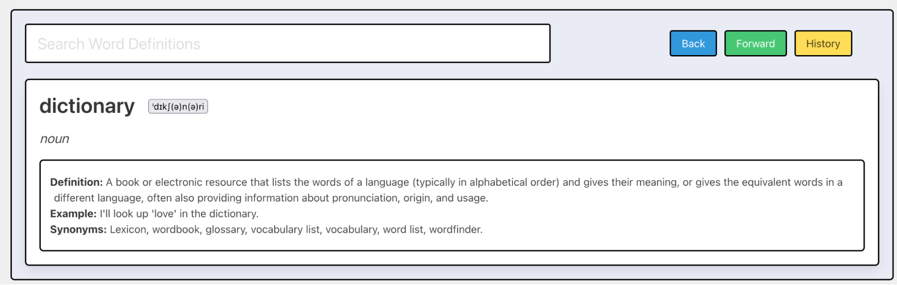

## Wins:
A win was figuring out how to code links to each word such that it ignored punctuation including complicated ones like brackets; I ended up coding to check for non-alphabet characters from either end, stopping the check when reaching an alphabet letter.

## Challenges:
A challenge was the public API being inconsistent with the punctuation and capitalizing the first word of sentences; I had to code such that it could correct that. 

## Key Learnings/Takeaways:
A key learning was that it is much easier to code together if you split up the tasks first such that you are working on different sections at the same time.

## Future Features:
A future feature would be to make the highlighting for the links also ignore punctuation. 
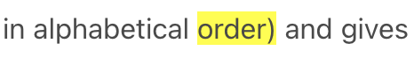
Another would be to add antonyms as the public API has updated to include those.

## Bugs:
A bug was that the API changed its format such that it would sometimes return an empty array in the synonyms section of the definition. This broke a function covering links and I had to add a section to ignore any inputs that are empty arrays.
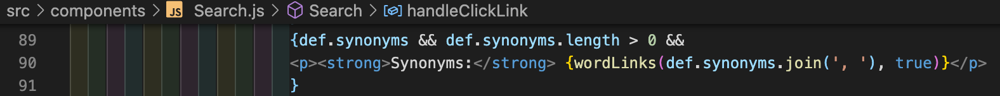
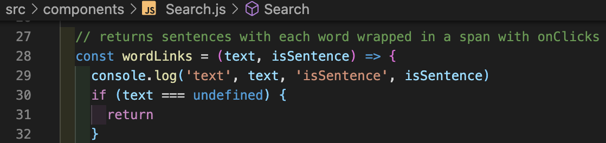
